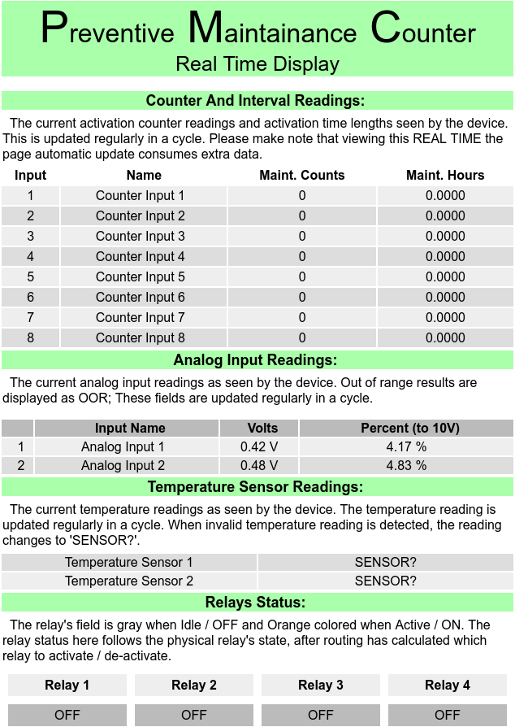

# PMC-Support

## PMC - public files -

    Documentation - drivers - support utilities

 Akostar project to count make / break cycles of external switches,
measure cumulative make-to-break time interval, and set an alert on temperature and
analog input values; based on configuration.

 This folder contains up-to-date documentation for the PMC device. Please
 click on pmc_master.pdf file to view / download.

#### Disclaimer:

Access given to this folder to allow our customers to see the most up to
date documentation and utilities. Given this purpose, the documents are under
constant revision, and no claims are made to the accuracy and correctness of the
contents of this folder. These documents are considered un-authoritative.
Should authoritative documents be needed, please reference the documents
delivered with the product.

### The main screen of the device (during development)

 EOF

