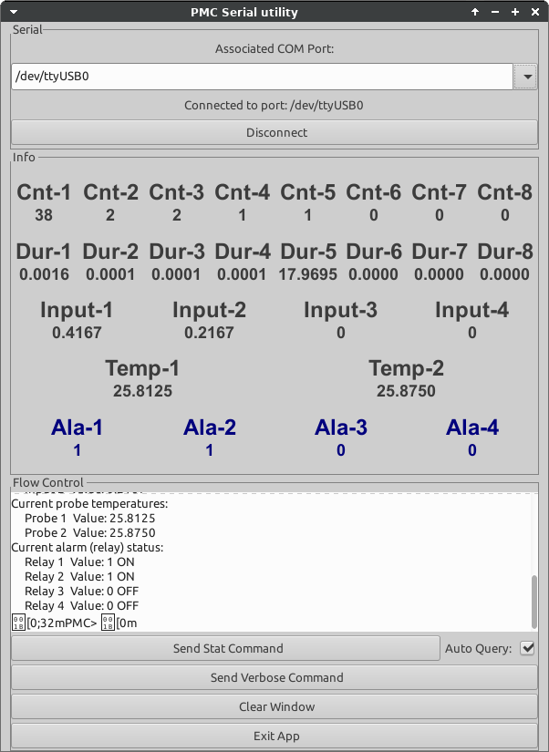

## PMC - support utilities

 This folder contains the serial utility for reading the PMC serial port. The utility
is provided as-is; considering it is a prototype.

  The reason for this utility is to demonstrate the capabilities derived from listening
to the serial port of the PMC. It is meant to show you how to intercept / listen to the PMC's
serial port, and how to parse out different fields; This may guide an
implementor / integrator to implement their version of data polling. Naturally,
any language may be used to implement this function.

   The utility is crafted in Python, running under Linux; however the toolkit used
is multi platform. It can be ported to Windows / Mac with relative ease. Please email Akostar
if you would like to deploy it on different platforms.

### Screen shot of the utility

  One can create accurate logs with an external device.  Also see -- extracting
information by polling the WiFi -- in our operations manual.

 EOF
